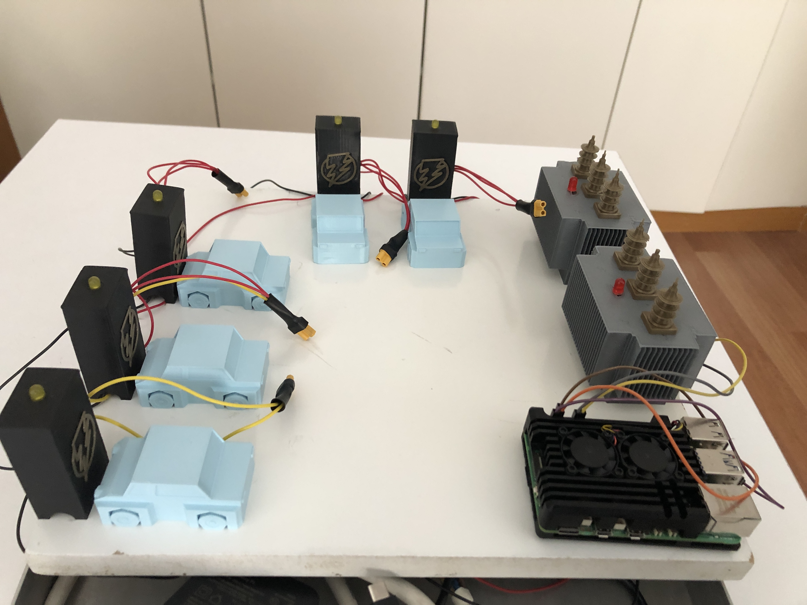

# Smart Transformer Load Balancer

This project implements an intelligent transformer load balancing system designed for educational and prototyping purposes. It simulates the dynamic load distribution between two transformers based on real-time current measurements using INA219 sensors.

## 🔧 Project Features

- ⚡ Measures current on two power lines via INA219 current sensors (I2C).
- 🔁 Relay 1 is always ON; Relay 2 activates automatically when total current exceeds a threshold.
- 📉 When the current drops below a defined threshold (hysteresis), Relay 2 deactivates.
- 🌐 Web-based dashboard using Flask and Chart.js to visualize real-time current data and relay status.
- 🖥️ Runs on Raspberry Pi with local network access.

## 📌 System Overview

- **INA219 #1**: Measures current from Transformer 1 (Relay 1).
- **INA219 #2**: Measures current from Transformer 2 (Relay 2).
- **Relay 1 (GPIO17)**: Always ON.
- **Relay 2 (GPIO27)**: Controlled automatically based on total current threshold.
- **Thresholds**: 
  - Activation: > 2.0 A
  - Deactivation: < 1.9 A (5% hysteresis)

## 📷 Project Images

### Transformer Monitoring Panel Screenshot

### Final Project Hardware Photo

